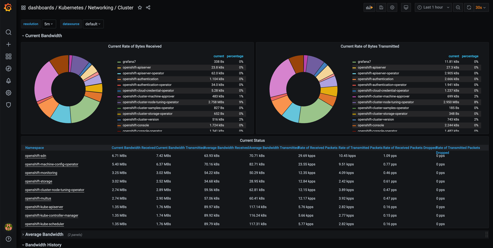

# Grafana 7 on OpenShift 4

[Grafana 7](https://grafana.com/docs/grafana/latest/guides/whats-new-in-v7-0/) includes many new powerful features and UX enhancements like unified data model, support for Jaeger datasource, new data transformations, new visualization panels and many more. This tutorial provides information how to:

- Deploy Grafana 7 on OpenShift using helm chart provided by Bitnami.
- Connect it to the existing OCP platform monitoring based on Prometheus.
- Migrate default OCP Prometheus dashboards to our new Grafana 7 instance.

As result you receive fully customizable and persistent Grafana 7 instance where we can create or customize dashboards, configure users teams and organizations, as well as install new panel and datasource plugins.

## Deploy Grafana

**Prerequisites:**
- Helm **3.x.**
- `oc login` as an OpenShift user with `cluster admin` role.

1. Clone this repository:

```sh
git clone https://github.com/rafal-szypulka/grafana7-openshift.git
cd openshift-grafana7
```

2. Review and edit provided `values.yml`. Detailed documentation can be found [here](https://github.com/bitnami/charts/tree/master/bitnami/grafana).
If you want to use specific `storageClass` for the Grafana PV, change the `pesistance.storageClass`. If you have default storageclass configured, you can leave `pesistance.storageClass` commented out.

1. Logon to your OpenShift cluster using `oc login`
2. Run deploy-grafana7.sh script. It will deploy Grafana in the `grafana` namespace.
Example output:
```sh
$ ./deploy-grafana7.sh
-> Create namespace grafana...
namespace/grafana created
-> Copy OCP Prometheus dashboards to the grafana namespace...
configmap/grafana-dashboard-cluster-total created
configmap/grafana-dashboard-etcd created
configmap/grafana-dashboard-k8s-resources-cluster created
configmap/grafana-dashboard-k8s-resources-namespace created
configmap/grafana-dashboard-k8s-resources-node created
configmap/grafana-dashboard-k8s-resources-pod created
configmap/grafana-dashboard-k8s-resources-workload created
configmap/grafana-dashboard-k8s-resources-workloads-namespace created
configmap/grafana-dashboard-node-cluster-rsrc-use created
configmap/grafana-dashboard-node-rsrc-use created
configmap/grafana-dashboard-prometheus created
-> Create ocp-prometheus service account and add viewer cluster role...
serviceaccount/ocp-prometheus created
clusterrole.rbac.authorization.k8s.io/view added: "ocp-prometheus"
-> Create OCP Prometheus datasource secret...
secret/datasource-secret created
-> Deploy Grafana 7 helm chart...
"bitnami" has been added to your repositories
Hang tight while we grab the latest from your chart repositories...
...Successfully got an update from the "humio" chart repository
...Successfully got an update from the "stable" chart repository
...Successfully got an update from the "bitnami" chart repository
Update Complete. ⎈ Happy Helming!⎈
NAME: grafana7
LAST DEPLOYED: Tue Jun 23 16:53:17 2020
NAMESPACE: grafana
STATUS: deployed
REVISION: 1
TEST SUITE: None
NOTES:
** Please be patient while the chart is being deployed **

1. Get the application URL by running these commands:
    echo "Browse to http://127.0.0.1:8080"
    kubectl port-forward svc/grafana7 8080:3000 &

2. Get the admin credentials:

    echo "User: admin"
    echo "Password: $(kubectl get secret grafana7-admin --namespace grafana -o jsonpath="{.data.GF_SECURITY_ADMIN_PASSWORD}" | base64 --decode)"
-> Create grafana7 route...
route.route.openshift.io/grafana7 created
GRFANA_URL: https://grafana7-grafana.apps.rs13.os.fyre.ibm.com
```

5. Wait until script completes and verify that Grafana pods started successfully.

```sh
$ oc get pods -n grafana
NAME                                       READY   STATUS    RESTARTS   AGE
grafana7-7955977dd7-v99r6                  1/1     Running   0          37m
grafana7-image-renderer-5c9f96b5bb-vhtcc   1/1     Running   0          37m
```

6. Access the GRAFANA_URL and verify that OCP default dashboards have been migrated and you can see the data.


